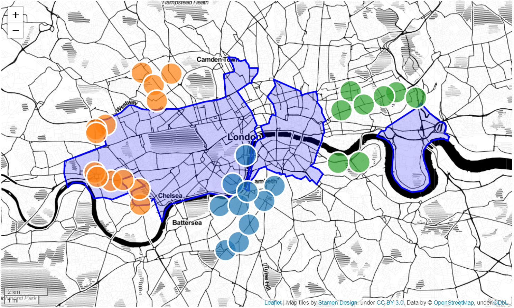

# Exploring locations to open an Italian restaurant in London

The objective of this project is to find the most suitable location(s) to open a new Italian restaurant in London using Foursquare's API and Scikit-learn machine learning module.

For interactive graphics view the .html file.
To run the Python code by yourself, see the .ipynb version.
Project's summary can be found in the Report/Report.pdf

